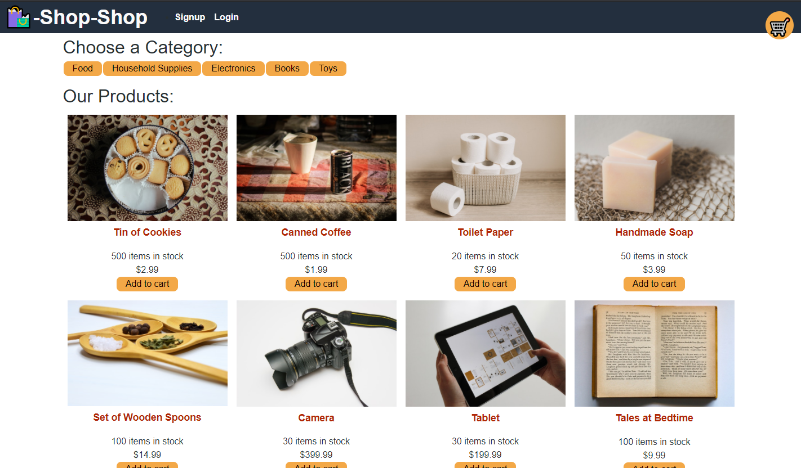
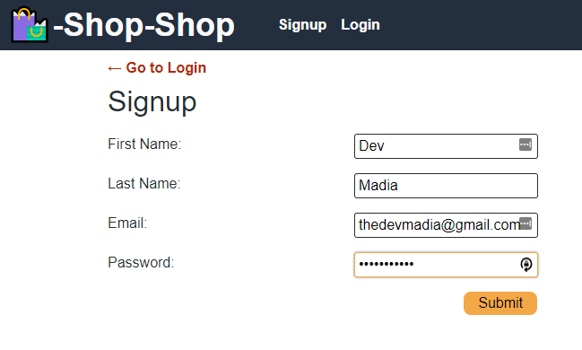
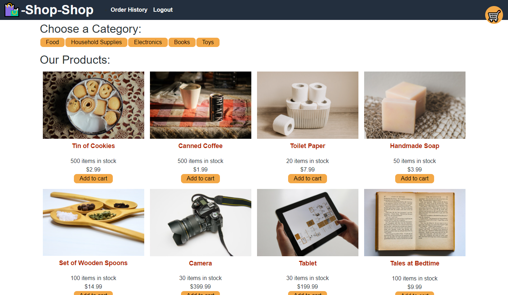
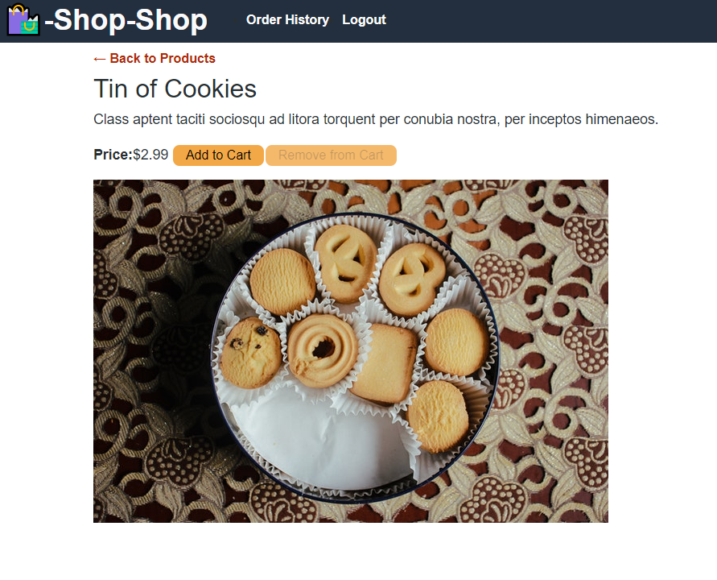
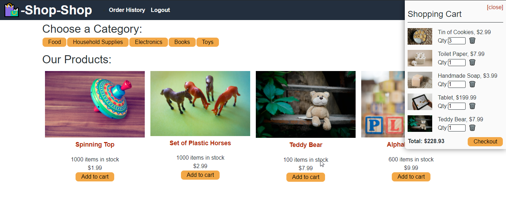
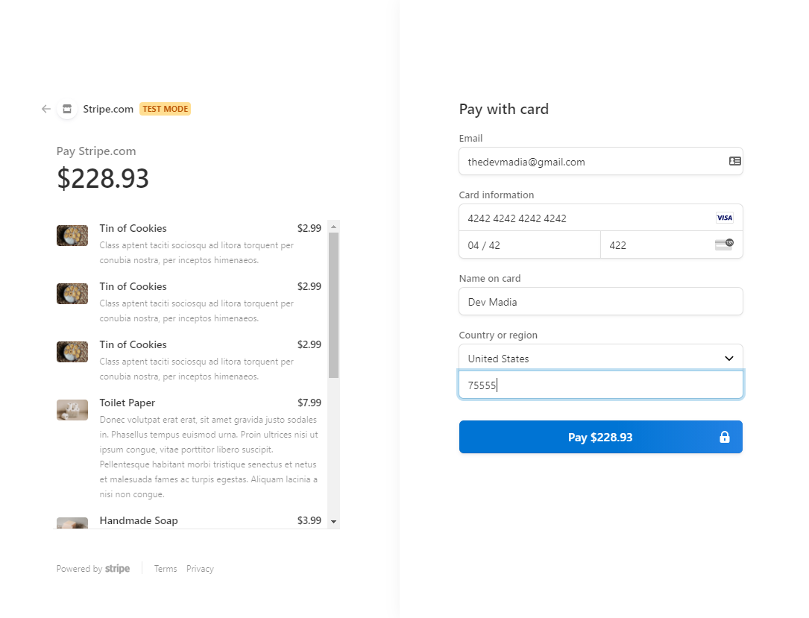
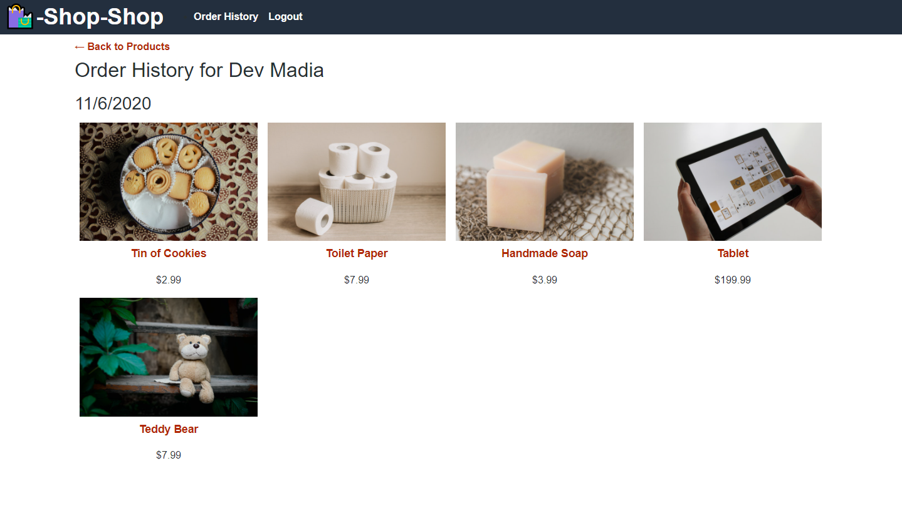

# Redux Shop

# Description
Example of how to manage global state using React’s Context API with an open-source JavaScript library called Redux.

## Table of Contents
  * [Installation](#installation)
  * [Usage](#usage)
  * [License](#license)
  * [Contributing](#contributing)
  * [Resources](#resources)
  * [Questions](#questions)

## Installation
Download a copy of this repo to a directory of your choice. To install, you will need to run `npm i` or `npm install` to get all the dependencies running. Following proper installation of the dependencies, you will then add the seeds by typing `npm run seed` followed by `npm start` on the root directory terminal to start the server.

To stop the server you will need to use the existing terminal to execute `CTRL+C` followed by `Y` for confirmation to terminate the connection to localhost.

Please see documentation on your own host's server commands should you run this on a live instance rather than locally.

## Usage
Be sure all repository files were successfully cloned to server and a connection to the database is complete.

Interactive Live Demo: https://aqueous-mesa-67588.herokuapp.com/

Customers will have the ability to create an account through a signup form found on the `Navigation Bar` located at the top of the webpage. Utilization of the `Navigation Bar` will help customers select shopping items for purchase. 

   

When an item is viewed, shoppers have the ability to add it to their cart. Customers have the ability, and extra bonus if they do so, to signup for an account to checkout orders with the intention of preserving their shopping history.

 

Once items are stored in the cart, customers will be able to checkout via Stripe before being redirected back to the `Shop-Shop` website. 

Once a customer is ready to complete their retail experience, they can select `Cart` to make final decisions on which items to purchase from their shopping cart. Any unwanted items can be removed from the cart at this time. Customers may also resume their shopping experience at any time should they chose so.

  

Customers will be able to review items as they checkout with Stripe before entering their payment information. Stripe will handle the transaction and email their receipt. However, items purchased also remain viewable in the customer's profile. Once payment processing concludes, shoppers are redirected to the `Shop-Shop` website.

## License
 This project is covered by the MIT license.

## Contributing
At this time, I am not seeking contributions to this application for `Shop-Shop`.

## Resources
 

 

 

  

  

  

## Questions
Please contact Devmadia by clicking below for immediate questions regarding site content:

For other projects by Devmadia [click here](https://github.com/Devmadia)